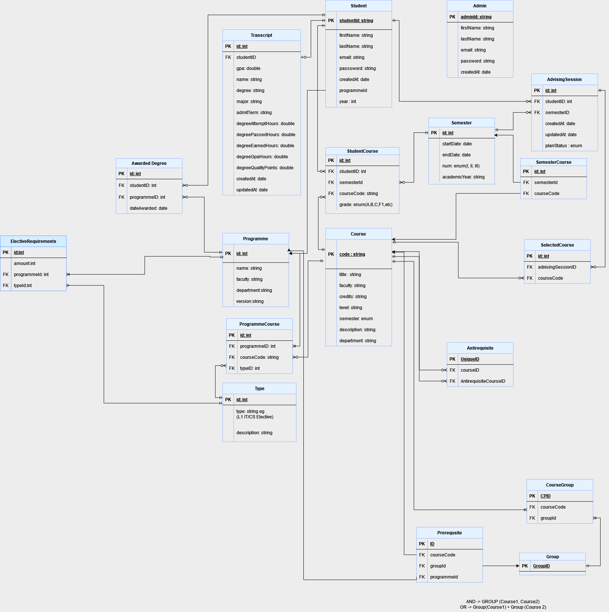

# Project Data Models

## Overview
This document provides an overview of the data models used in the project. It explains the various models, their attributes, and the relationships between them. This is intended to help new developers understand the database structure and how to interact with it using Sequelize.

## Models

### Student
Represents a student in the system.

- **Attributes:**
  - `studentId` (STRING, Primary Key)
  - `firstName` (STRING, Not Null)
  - `lastName` (STRING, Not Null)
  - `email` (STRING, Not Null, Unique, Validates Email Format)
  - `password` (STRING, Not Null)
  - `programmeId` (INTEGER, Nullable)
  - `year` (STRING, Not Null)

- **Associations:**
  - `Student` has one `Transcript`
  - `Student` has many `AwardedDegree`
  - `Student` belongs to `Programme`
  - `Student` has many `StudentCourse`
  - `Student` has many `AdvisingSession`

### Programme
Represents an academic programme.

- **Attributes:**
  - `name` (STRING, Not Null)
  - `faculty` (STRING, Not Null)
  - `department` (STRING, Not Null)
  - `version` (STRING, Not Null)

- **Associations:**
  - `Programme` has many `Student`
  - `Programme` has many `Prerequisite`
  - `Programme` has many `AwardedDegree`
  - `Programme` has many `ElectiveRequirement`
  - `Programme` has many `ProgrammeCourse`

### Transcript
Represents the transcript of a student.

- **Attributes:**
  - `id` (INTEGER, Primary Key)
  - `gpa` (DECIMAL(5, 2), Not Null)
  - `name` (STRING, Not Null)
  - `degree` (STRING, Not Null)
  - `major` (STRING, Not Null)
  - `admitTerm` (STRING, Not Null)
  - `degreeAttemptHours` (DECIMAL(5, 2), Not Null)
  - `degreePassedHours` (DECIMAL(5, 2), Not Null)
  - `degreeEarnedHours` (DECIMAL(5, 2), Not Null)
  - `degreeGpaHours` (DECIMAL(5, 2), Not Null)
  - `degreeQualityPoints` (DECIMAL(5, 2), Not Null)
  - `createdAt` (DATEONLY, Not Null)
  - `updatedAt` (DATEONLY, Not Null)

- **Associations:**
  - `Transcript` belongs to `Student`

### AwardedDegree
Represents a degree awarded to a student.

- **Attributes:**
  - `dateawarded` (DATE, Not Null)

- **Associations:**
  - `AwardedDegree` belongs to `Student`
  - `AwardedDegree` belongs to `Programme`

### Course
Represents a course offered by the institution.

- **Attributes:**
  - `code` (STRING, Primary Key, Not Null)
  - `title` (STRING, Not Null)
  - `faculty` (STRING, Not Null)
  - `credits` (INTEGER, Not Null)
  - `level` (STRING, Not Null)
  - `semester` (ENUM('I', 'II', 'III'), Not Null)
  - `department` (STRING, Not Null)
  - `description` (TEXT, Not Null)

- **Associations:**
  - `Course` has many `StudentCourse`
  - `Course` has many `ProgrammeCourse`
  - `Course` has many `SelectedCourse`
  - `Course` has many `SemesterCourse`
  - `Course` has many `Prerequisite`
  - `Course` has many `Antirequisite`
  - `Course` has many `CourseGroup`

### StudentCourse
Represents a course that a student is enrolled in.

- **Attributes:**
  - `grade` (ENUM('A+', 'A', 'A-', 'B+', 'B', 'B-', 'C+', 'C', 'F1', 'F2', 'F3'), Nullable)

- **Associations:**
  - `StudentCourse` belongs to `Student`
  - `StudentCourse` belongs to `Course`
  - `StudentCourse` belongs to `Semester`

### AdvisingSession
Represents an advising session for a student.

- **Attributes:**

- **Associations:**
  - `AdvisingSession` belongs to `Student`
  - `AdvisingSession` belongs to `Semester`
  - `AdvisingSession` has many `SelectedCourse`

### SelectedCourse
Represents a course selected during an advising session.

- **Attributes:**

- **Associations:**
  - `SelectedCourse` belongs to `AdvisingSession`
  - `SelectedCourse` belongs to `Course`

### Prerequisite
Represents a prerequisite for a course.

- **Attributes:**

- **Associations:**
  - `Prerequisite` belongs to `Programme`
  - `Prerequisite` belongs to `Course`
  - `Prerequisite` belongs to `Group`

### Antirequisite
Represents an anti-requisite for a course.

- **Attributes:**

- **Associations:**
  - `Antirequisite` belongs to `Course` (courseCode)
  - `Antirequisite` belongs to `Course` (antirequisiteCourseCode)

### CourseGroup
Represents a group of courses.

- **Attributes:**

- **Associations:**
  - `CourseGroup` belongs to `Course`
  - `CourseGroup` belongs to `Group`

### Group
Represents a group that can have many prerequisites or course groups.

- **Attributes:**

- **Associations:**
  - `Group` has many `Prerequisite`
  - `Group` has many `CourseGroup`

## Relationships Diagram
For a visual representation, refer to the ER diagram that maps out these associations.

## Sequelize Configuration
All models are defined using Sequelize, an ORM for Node.js. Ensure you have the following setup in your project:

### Database Configuration
Make sure you configure your `db.js` or environment variables to connect to your database.

### Associations
Associations between models are defined in `associations.js`. This file must be imported after all model definitions to ensure associations are correctly established.
