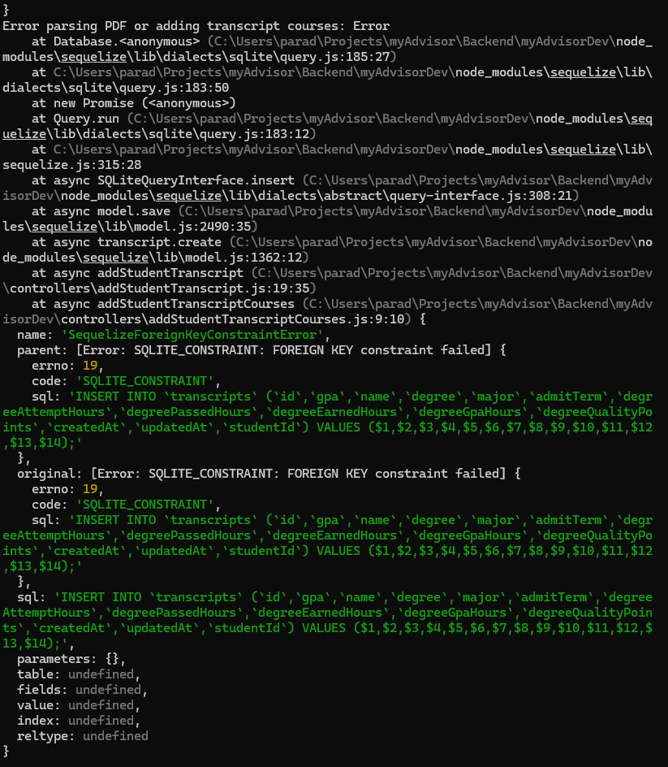

# Description of Issue
When attempting to upload a transcript generated after the 14th of March 2024^1 the system returns the below backend readout. 

# Steps to Reproduce
1. Login to the myAdvisor system with any student account.
2. Navigate to the "Academic History" section ({host}/dashboard/academic-history).
3. Upload "transcript_broken.pdf" linked in this repository.

### Footnotes
1. The date of generation of the current working transcript.